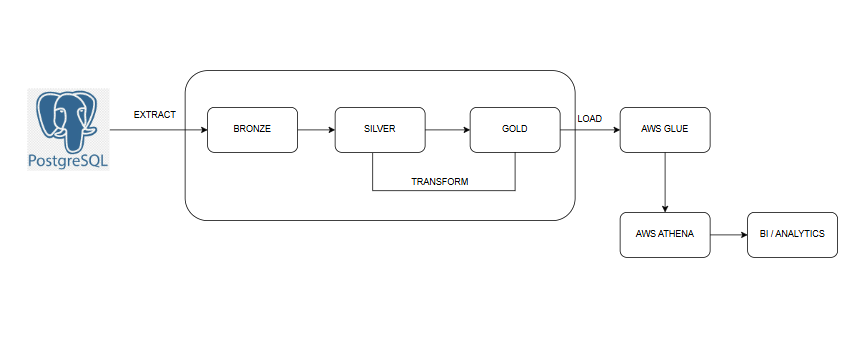
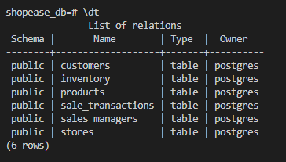
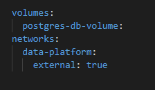
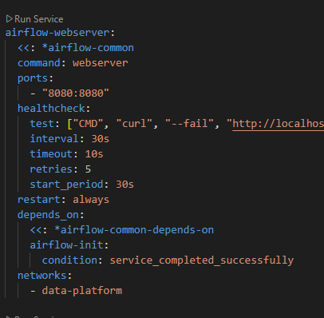
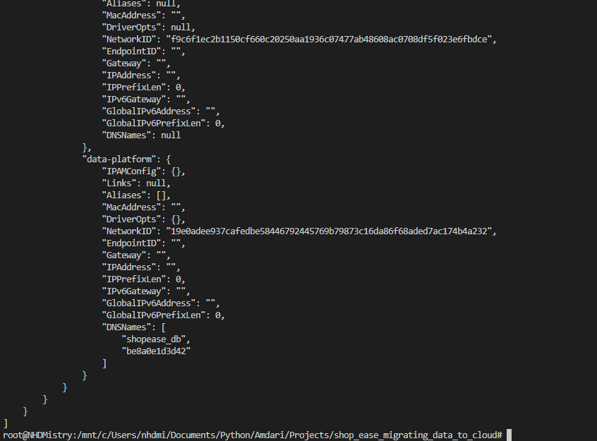
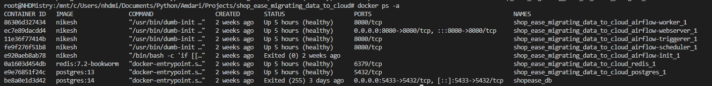
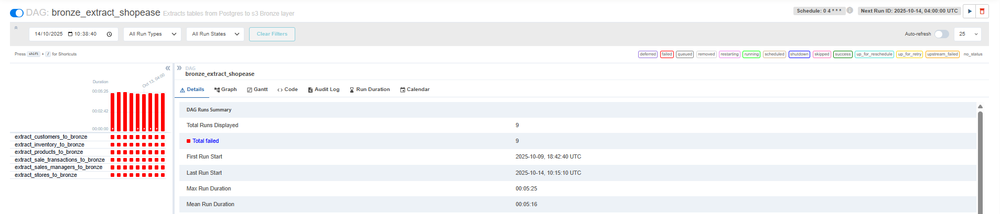
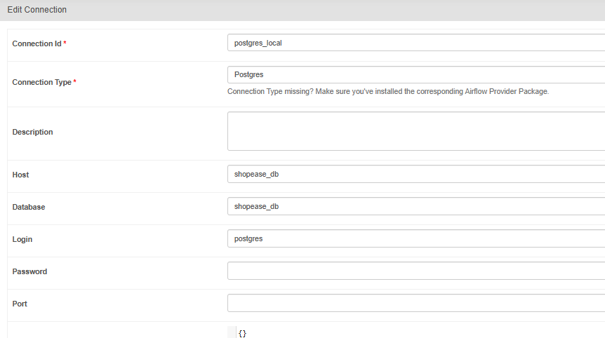
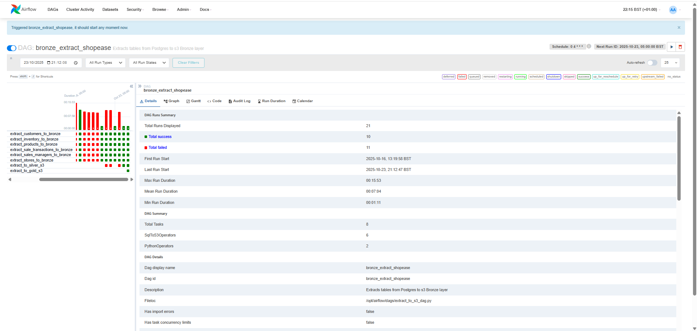
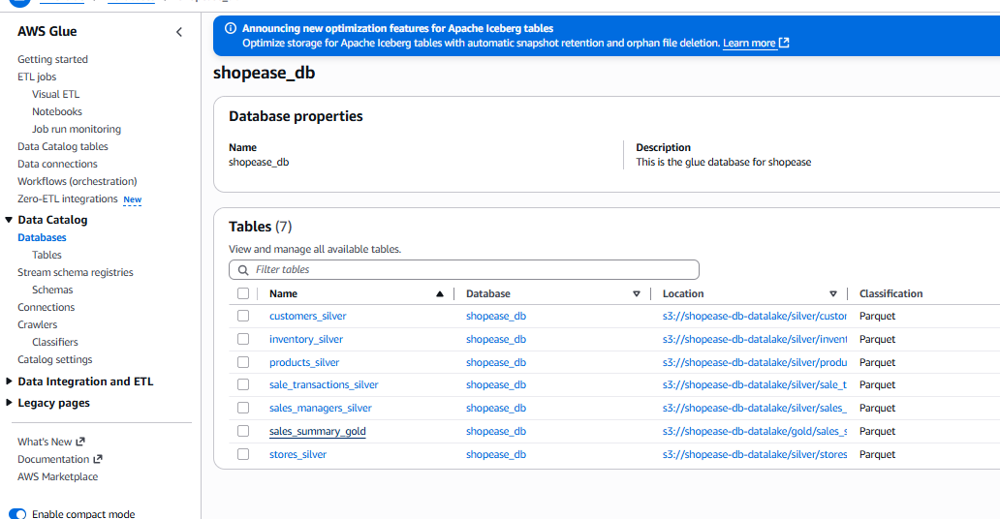

# Migrating On-Premise Data to the Cloud

This project demonstrates how to migrate on-premise PostgreSQL transactional data to a cloud-based data lake using Apache Airflow, AWS S3, Glue, and Athena. The pipeline follows the Medallion Architecture (Bronze, Silver, Gold) to modernize data accessibility and enable analytics at scale.

## Medallion Architecture
### Features

- 🥉 **Bronze**: Extracts tables from the dump file PostgreSQL to S3 using Airflow and the `SqlToS3Operator`.
- 🥈 **Silver**: Transforms CSV data to Parquet using AWS Wrangler, partitions by date, and registers tables in AWS Glue.
- 🥇 **Gold**: Aggregates and curates business-ready datasets (e.g., sales summary) using Athena queries and stores them in S3.
- Automated orchestration with Apache Airflow (Docker) for end-to-end workflow management.
- Query business-ready tables using AWS Athena for reporting (e.g., daily sales, top customers, category revenue).

## Project Structure



## Requirements
-  Python 3.10+
-  Dump file to restore the Legacy data migrating to AWS Cloud
-  Docker & Docker Compose
-  Apache Airflow
-  AWS S3, Glue & Athena permission
-  Python packages: awswrangler, apache-airflow-providers-amazon, pandas, boto3
-  Install dependencies with:
   ```
   pip install awswrangler apache-airflow-providers-amazon pandas boto3
   ```

## AWS IAM (Identity and Access Management) Setup
The below steps needs to be executed before Apache Airflow can send data to AWS S3 Bucket, Glue & Athena:
1. Create an IAM User
   -  Go to the **AWS Console → IAM → Users → Add user**
   -  Enter a **username** *(e.g., airflow-etl-user)*
   -  Select **Programmatic** access
   -  Click **Next**

2. Attach Permissions
   -  Attach relevant policies from `'Add Permissions'`
   -  Click **Next** and then **Create user**

3. Get Access Keys:
   -  After creation, either download or copy the **Access Key ID** and **Secret Access Key**

4. Configure Credentials
   -  Credentials are added to the `.env` file in the project:
   ```
   ACCESS_KEY=YOUR_ACCESS_KEY_ID
   SECRET_KEY=YOUR_SECRET_ACCESS_KEY
   REGION=YOUR_AWS_REGION
   ```
   -  For Airflow, set these credential in **Airflow Variables** or **Connections** for better security after the Airflow is connected.

## Setup & Usage
1. **Docker Setup** (Depending on the operating system a user is using)
   -  Windows - [https://docs.docker.com/desktop/setup/install/windows-install/](https://docs.docker.com/desktop/setup/install/windows-install/)
   -  Mac - [https://docs.docker.com/desktop/setup/install/mac-install/](https://docs.docker.com/desktop/setup/install/mac-install/)
   -  Linux - [https://docs.docker.com/desktop/setup/install/linux/](https://docs.docker.com/desktop/setup/install/linux/)

2. Docker command utilised to pull docker image and creating a docker container:
   -  Downloading the image from Docker Hub:
   ```wsl
   docker pull <image_name>
   ```
   -  View the downloaded image:
   ```wsl
   docker images
   ```
   -  Build and run a container to start PostgreSQL in Docker:
   ```
   docker run --name <container_name> -e POSTGRES_PASSWORD=<set_password> -p <host_port>:<container_port> -d <image_name_to_run_in_background>
   ```

3. Retrieving and restoring the legacy PostgreSQL dump file from the local database, preparing it for migration to AWS cloud services:
   -  Connecting to PostgreSQL:
   ```
   psql -h localhost -p <host_port> -U <user>
   ```
   -  Creating a Database to store the legacy dump file:
   ```
   CREATE DATABASE <database_name>;
   ```
   -  Restoring the dump file:
   ```
   psql -h localhost -p <host_port> -U <user> -d <database_name> -f <filename_to_restore>
   ```
   -  Viewing the dump file in the database using psql terminal:
   ```
   psql -h localhost -p <host_port> -U <user> -d <database_name>
   ```
   -  Checked the database to view if the tables have been restored and listed successfully, an example is shown below:
      
      e.g:
      

4. **3 Python script file** was created and placed in the *dags folder* for Airflow to automatically detect and schedule, with a brief description of each file's responsibility.:
   -  [extract_to_s3_dag.py](dags/extract_to_s3_dag.py) - This file contains the Airflow DAG that orchestrates the ETL pipeline. It schedules the extraction of tables from a Postgres database to the S3 Bronze layer, then triggers two PythonOperator tasks: one for transforming Bronze data to Silver (using a function from `write_to_s3_silver.py`), and another for moving Silver data to Gold (using a function from `write_to_s3_gold.py`). The DAG enforces the correct order of operations by defining dependencies between these tasks, ensuring a smooth and reliable data flow through each stage of the pipeline.
   -  [write_to_s3_silver.py](dags/write_to_s3_silver.py) - This file is imported into extract_to_s3_dag.py file for the define function to be called. Once called it reads raw CSV data from the S3 Bronze layer, cleans and standardizes the column names, and then writes the transformed data as partitioned Parquet files to the S3 Silver layer. It uses AWS Wrangler for data operations and registers the resulting tables in the database that was created in AWS Glue, preparing the data for further analytics and processing.
   -  [write_to_s3_gold.py](dags/write_to_s3_gold.py) - This file is imported into extract_to_s3_dag.py file for the define function to be called. Once called it runs an Athena SQL query to aggregate sales data from the Silver layer, calculating total sales and revenue per store. The results are then written as Parquet files to the S3 Gold layer and registered in AWS Glue, making the curated, business-ready data available for analytics and reporting.

5. **Start Airflow with Docker Compose**
   -  Copy `docker-compose.yaml` command from https://airflow.apache.org/docs/apache-airflow/stable/howto/docker-compose/index.html and paste the below in Bash:
   ```bash
   curl -LfO 'https://airflow.apache.org/docs/apache-airflow/3.1.2/docker-compose.yaml'
   ```
   -  Creating a network and connecting both container thats got the dump file and network together, so both can communiate to each other.after the docker command is executed `docker-compose up` is up and running:

   -  Before altering the docker-compose.yaml file, enter the below docker commands:
   ```wsl
   docker-compose down
   ```
   -  Stops the active container from running as the container needs to be altered:
   ```wsl
   docker stop <container_name>
   ```
   -  Create a network:
   ```wsl
   docker network create <network_name>
   ```
   -  Enter the network name to .yaml file:
      
      e.g:

      

   -  After each services enter the network name:
      
      e.g:
      
      

   -  Connect both Container and network together:
      ```wsl
      docker network connect <network_name> <container_name>
      ```
   -  Check the container to view if the network_name is added to the container
      ```wsl
      docker start <container_name>
      ```
   -  Network name should be added at the end of the container, like the one below:
      e.g:
      ```wsl
      docker inspect <container_name>
      ```
      
   -  After all that is done, enter this command `docker-compose up -d` for all the services in the .yaml file will be added and running in the container list.
      ```wsl
      docker ps
      ```
      Below is an example of the output snip of the container services that are running. For a Airflow to run successfully all containers in here needs to be 'healthy', if a container is unhealthy then the Access Airflow UI will not be running, so below docker command is executed for the container to restart:
      ```
      docker start <container_id>
      ```
      

   -  Once all containers are 'healthy' *Step 6* is next.

6. **Access Airflow UI**
   Visit [http://localhost:8080](http://localhost:8080) and trigger the `bronze_extract_shopease` DAG.

   -  If there is an error from running the Airflow UI, that will mean that airflow-webserver needs to be altered next as the legacy data will require for the data to be transferred over and stored in the S3 Bucket.

      ```wsl
      docker-compose down
      ```
      ```wsl
      docker stop <container_id_for_airflow-webserver>
      ```
      Inside the airflow-webserver container:
      ```wsl
      docker exec -it <container_id_for_airflow-webserver> bash
      ```
      e.g:
      ```wsl
      airflow@<container_id>:/airflow$
      ```

      Once inside the airflow-server container, create a database and restore the dump file for the airflow-webserver to be utilised

   -  Exit and restart the `docker-compose -d` and check if all container services are healthy and running. Re-visit [http://localhost:8080](http://localhost:8080) and to check if Airflow UI is up and `bronze_extract_shopease` DAG is triggered.

      If an error occured (like the one below), then it a connection to S3 Bucket that wasn't connected successfully on Airflow UI:
      

7. **Entering credentials in Airflow** for successful connection to **S3 Bucket**.
   
   Once connection to Airflow was made, the below section needs to be filled in: 
   -  **Admin --> Connection**:
   
   -  and **Admin --> Variables**:
      Enter the **Access Key, Secret Key** and **Region** from the `.env` file
   -  Once all credentials are entered, restart the trigger the DAG and this time the Airflow UI should run successfully, like the one below:
   

## Data Visualation

1. **Data send to S3 Bucket** - Verify your AWS S3 bucket to ensure that the expected folders and files have been created. Data should be stored in both CSV and Parquet formats. An example is shown below:
e.g:
   1. [Folders created in S3 Bucket](images/extract_to_s3_bucket1.png)
   2. [.csv raw data files are stored in the Bronze folder](images/extract_to_s3_bucket2.png)
   3. [Data Transformation and stored in Silver folder as .parquet file](images/extract_to_s3_bucket3.png)
   4. [Summary of the parquet file is created and saved](images/extract_to_s3_bucket4.png) inside the Gold folder

2. **Check AWS Glue and Athena**  
   Transformed data in Silver folder that is send automatically to AWS Glue and AWS Athena once Gold layer is triggered, which allows analyst to perform SQL queries.
   e.g:
   **AWS Glue**
   -   The .parquet files inside Silver folder of the S3 Bucket are automatically sent to AWS Glue and stored in the Database of the Data Catalog for AWS Athena to retrieve the file, analysis and process the file. An example is shown below:

         e.g:
            

   **AWS Athena**
   -   Once Athena retrieves the data from AWS Glue database, it allows Analyst users to query the database/ tables. Example of the AWS Athena is shown below:
   
         e.g:
         

## Notes
**AWS Wrangler** - utilised instead of AWS Glue Crawler because it provides direct, programmatic control over data transformation and cataloging within Python scripts. With AWS Wrangler, you can read, clean, and write data to S3 in Parquet format and register tables in the Glue Data Catalog database all in one step, making the ETL process more efficient and fully automatable within the Airflow pipeline, without needing to trigger separate Glue Crawler jobs. This approach offers greater flexibility and integration for custom data processing workflows.

**AWS Athena** - utilised for serverless, on-demand querying of data stored in S3 Bucket using standard SQL, making it easy to analyse large datasets without managing infrastructure. Athena integrates seamlessly that supports direct querying of Parquet files, which improves performance and reduces costs.

Athena pricing is based on the amount of data scanned per query. 

-  For example, the cost is $5.00 per terabyte (TB) scanned if the file exceed more than 1(TB). If a query scans 100 GB of data, the cost would be:

   $5.00 × (100 GB / 1024 GB) ≈ $0.50 per query.

-  Another example of Athena pricing, if a query scans is less than 1TB (e.g: 45.5MB), then the following calaculation is utilised:

   1 TB = 1 024 GB = 1 048 576 MB

   The price per MB = $5 / 1 048 576 ≈ $0.000004768 per MB

   If one SQL query scans all these tables (≈ 45.485 MB):

   45.485𝑀𝐵 × $0.000004768 = $0.0002168
   = US $0.00022 (i.e., ~0.02 cents per query) - As the MB is above 10MB (which is a minimum), so no rounding needed.

- Optimizing data formats (like using Parquet) and partitioning can significantly reduce the amount of data scanned and lower costs.

## Author:
Developed by Nikesh Mistry, If you like this project, please give this project a ⭐, thanks 😄 
